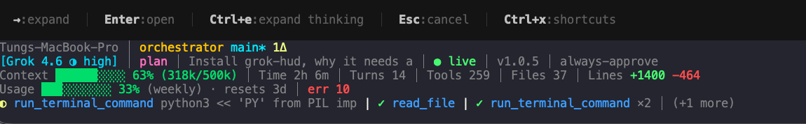

# grok-hud

[English](README.md) · [Tiếng Việt](README.vi.md)

```
                     __         __              __
   ____ __________  / /__      / /_  __  ______/ /
  / __ `/ ___/ __ \/ //_/_____/ __ \/ / / / __  /
 / /_/ / /  / /_/ / ,< /_____/ / / / /_/ / /_/ /
 \__, /_/   \____/_/|_|     /_/ /_/\__,_/\__,_/
/____/
```

**HUD 5 dòng** dưới Grok TUI: model, git, context, credit tuần, tool gần nhất.

Grok không có API `statusLine`. grok-hud gắn HUD bằng tmux **cùng cửa sổ** (không tách pane).

## Tài trợ bởi [XCloudPhone.com](https://xcloudphone.com)

<p align="center">
  <a href="https://xcloudphone.com">
    
    
  </a>
</p>

```
 ___  ___    ______    ___           ______     ____  ____   ________      _______     __    __       ______     _____  ___     _______             ______       ______     ___      ___
|"  \/"  |  /" _  "\  |"  |         /    " \   ("  _||_ " | |"      "\    |   __ "\   /" |  | "\     /    " \   (\"   \|"  \   /"     "|           /" _  "\     /    " \   |"  \    /"  |
 \   \  /  (: ( \___) ||  |        // ____  \  |   (  ) : | (.  ___  :)   (. |__) :) (:  (__)  :)   // ____  \  |.\\   \    | (: ______)          (: ( \___)   // ____  \   \   \  //   |
  \\  \/    \/ \      |:  |       /  /    ) :) (:  |  | . ) |: \   ) ||   |:  ____/   \/      \/   /  /    ) :) |: \.   \\  |  \/    |             \/ \       /  /    ) :)  /\\  \/.    |
  /\.  \    //  \ _    \  |___   (: (____/ //   \\ \__/ //  (| (___\ ||   (|  /       //  __  \\  (: (____/ //  |.  \    \. |  // ___)_    _____   //  \ _   (: (____/ //  |: \.        |
 /  \   \  (:   _) \  ( \_|:  \   \        /    /\\ __ //\  |:       :)  /|__/ \     (:  (  )  :)  \        /   |    \    \ | (:      "|  ))_  ") (:   _) \   \        /   |.  \    /:  |
|___/\___|  \_______)  \_______)   \"_____/    (__________) (________/  (_______)     \__|  |__/    \"_____/     \___|\____\)  \_______) (_____(   \_______)   \"_____/    |___|\__/|___|
```

**Điện thoại đám mây thật cho game thủ** — không phải giả lập, không phải VPS. Thuê máy Android thật trên cloud, chơi / farm 24/7.

→ [xcloudphone.com](https://xcloudphone.com)

---



```
Tungs-MacBook-Pro │ orchestrator main* 1Δ
[Grok 4.6 ◑ high] │ plan │ Install grok-hud… │ ● live │ v1.0.5 │ always-approve
Context ██████░░░░ 63% (318k/500k) │ Time 2h 6m │ Turns 14 │ Tools 259 │ Files 37 │ Lines +1400 -464
Usage ███░░░░░░░ 33% (weekly) · resets 3d │ err 10
◐ run_terminal_command … | ✓ read_file | ✓ run_terminal_command ×2
```

| Dòng | Hiện gì |
|------|---------|
| 1 | hostname · repo · nhánh* · file dirty |
| 2 | `[model ◑ effort]` · plan/ask · tiêu đề phiên · live · version · quyền |
| 3 | thanh context % token · thời gian · lượt · tool · file · dòng +/- |
| 4 | usage tuần · đếm ngược reset · sandbox · compact · lỗi |
| 5 | tool gần nhất |

Màu lấy từ một palette hex trong `config.json`. Thanh context, `● live`, `+dòng`, và `✓` cùng xanh; cảnh báo cùng vàng; lỗi cùng đỏ.

Thanh context bám meter live của Grok (`params._meta.totalTokens` trong `updates.jsonl`), không phải snapshot cuối lượt trong `signals.json`. Tmux refresh khoảng 1 giây.

## Cài (một lệnh)

```bash
curl -fsSL https://raw.githubusercontent.com/mrkungfudn/grok-hud/main/install.sh | bash
```

Installer **tự cài thứ còn thiếu**: Git, Node.js ≥ 18, tmux, và [Grok CLI](https://x.ai/build) (`curl -fsSL https://x.ai/cli/install.sh | bash`). macOS dùng Homebrew (cài brew nếu chưa có). Linux dùng apt / dnf / pacman, hoặc nvm cho Node.

Mở **tab terminal mới**, rồi gõ `grok`. HUD nằm dưới đáy.

Chạy trong **herdr** cũng được (`herdr agent start --kind grok`, hoặc gõ `grok` ở tab herdr mới). Herdr không phải tmux; grok-hud vẫn bọc Grok trong `tmux -L grok-hud` nên HUD 5 dòng giống tab thường. Phải dùng **tab herdr mới** sau khi cài — pane cũ vẫn trỏ binary `grok` trần.

Cập nhật: chạy lại đúng lệnh `curl … | bash`.

## Copy cái này cho agent

Không cần nhớ lệnh — dán khối dưới vào Grok, Claude, Cursor, Codex, hoặc agent nào đang dùng:

```
Cài grok-hud trên máy này từ https://github.com/mrkungfudn/grok-hud

Chạy một lệnh này (tự cài Git, Node.js ≥ 18, tmux, và Grok CLI nếu thiếu):

curl -fsSL https://raw.githubusercontent.com/mrkungfudn/grok-hud/main/install.sh | bash

Xong bảo tôi mở TAB TERMINAL MỚI rồi gõ `grok`. HUD là 5 dòng tmux dưới Grok TUI — không tách pane iTerm/tmux. Tắt: GROK_HUD_AUTO=0 grok. Binary Grok thật vẫn ở ~/.grok/bin/grok.

Nếu repo đã clone sẵn thì chạy `bash install.sh` ở root repo, đừng curl.

Đừng gắn vào tmux/herdr đang có của user. Wrap dùng socket riêng: tmux -L grok-hud.
```

## Dùng

| | |
|---|---|
| Hiện HUD | `grok` (tab mới, hoặc `source ~/.zshrc`) |
| Tắt HUD | `GROK_HUD_AUTO=0 grok` |
| Binary Grok trần | `~/.grok/bin/grok` |
| Màu / field | `~/.grok/plugins/grok-hud/config.json` |
| Snapshot một lần | `grok-hud` |
| JSON | `grok-hud --json` |

## Gỡ

```bash
# 1) Xóa khối # >>> grok-hud >>> … # <<< grok-hud <<< trong ~/.zshrc và ~/.bashrc
# 2) Plugin
grok plugin uninstall grok-hud --confirm

# 3) File
rm -rf ~/.grok/plugins/grok-hud ~/.local/share/grok-hud ~/.local/bin/grok-hud
# Trả PATH grok về binary thật (installer từng trỏ ~/.local/bin/grok sang wrap HUD):
ln -sfn "$HOME/.grok/bin/grok" "$HOME/.local/bin/grok"
```

## Development

```bash
git clone git@github.com:mrkungfudn/grok-hud.git
cd grok-hud
npm install
npm run build
bash install.sh
```

Toàn bộ option: [`config.example.json`](config.example.json). Ghi chú cho agent: [`AGENTS.md`](AGENTS.md).

## License

MIT. Copyright (c) 2026 mrkungfudn.
